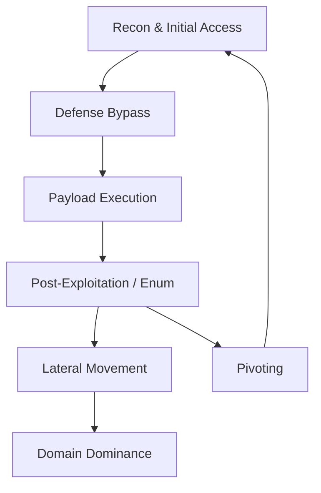

# 👑 OSEP Master Attack Runbook (400/500 Level)

> [!ABSTRACT]
> This is your **Decision Engine** for the exam. Follow the flow, identify the scenario, and jump to the protocol-specific runbook.
> **Source of Truth**: All protocol-specific notes are in `0.1 Runbooks/`.

---

## 🗺️ The Global Attack Flow



---

## [1] Initial Access & Web Recon
**Goal**: Get a shell on the first box.
- **Web Discovery**: [[0.1 Runbooks/Web Attacks]] (Feroxbuster, FFUF, VHosts)
- **Initial Exploits**: SSRF, LFI, SQLi (see [[0.1 Runbooks/SQL Attacks]])
- **MSSQL Entry Point**: [[05-lateral-movement/mssql/RUNBOOK.md]] (setspn discovery, Windows Auth, xp_cmdshell)
  - NTLM hash capture via xp_dirtree + relay: [[05-lateral-movement/mssql/ntlm-via-sql.md]]
- **Delivery**: [[02-phishing/]] (HTA, Macros, JScript)
  - Calendar phishing (.ics NTLM coercion): [[02-phishing/calendar/README.md]]
  - ISO/VHDX MOTW bypass + LNK: [[02-phishing/containers/README.md]]
  - Remote Template Injection + XLM macros: [[02-phishing/office-macros/advanced-delivery.md]]
  - HTA + WSF multi-stage templates: [[02-phishing/wsf-hta/README.md]]
  - SMTP delivery (swaks): [[02-phishing/swaks-delivery.md]]
- **Kiosk breakout**: [[11-kiosk/README.md]]

---

## [2] Defense Bypass & Execution
**Goal**: Run code without getting caught by AMSI/CLM/EDR.
- **Host Triage First**: `host-triage.ps1` — checks Defender, RunAsPPL, CredentialGuard, exclusions
- **Bypass Decision**:
  - **AMSI/CLM Active**: Use `InstallUtil` via [[03-loaders/shellcode-runners/clrunner.cs]]
  - **Defender Active**: Use AES Encrypted loaders in [[03-loaders/]]
  - **AV Signatures on shellcode**: IPv4 obfuscation → [[03-loaders/ipv4-obfuscation/README.md]]
  - **ETW Telemetry**: Patch EtwEventWrite → [[01-evasion/etw-bypass/README.md]]
  - **EDR Active**: D/Invoke loaders → [[03-loaders/d-invoke/README.md]]
- **Network filters blocking shell**: [[09-pivoting/network-filters/README.md]]

---

## [3] Elevation & Persistence
**Goal**: Gain `SYSTEM` or `root` to dump credentials.
- **Windows — Service Account (SeImpersonatePrivilege)**: [[06-credentials/token-impersonation/README.md]]
  - GodPotato (Win10/11+Server2019/2022), PrintSpoofer (Server2016/Win10), SweetPotato
- **Windows PrivEsc**: [[0.1 Runbooks/Windows Privilege Escalation]] (Potato attacks, DLL Hijacking)
- **Linux PrivEsc**: [[0.1 Runbooks/Linux Privilege Escalation]] (Sudo, SUID, Capabilities)
- **Windows Persistence**: [[10-persistence/windows/wmi-persistence.md]] (WMI events, Scheduled Tasks)
- **Linux Persistence**: [[10-persistence/linux/cron-persistence.md]], [[10-persistence/linux/ssh-persistence.md]]
- **GPO Enterprise Persistence**: [[07-active-directory/gpo-abuse.md]]

---

## [4] Lateral Movement & Pivoting
**Goal**: Reach the next network segment.
- **Credential Reuse Matrix (PTH/PTT/OPtH)**: [[06-credentials/ptx-matrix.md]]
- **DCOM stealth execution**: [[05-lateral-movement/windows/dcom-rdp.md]]
- **RDP session hijacking (tscon)**: [[05-lateral-movement/windows/dcom-rdp.md]]
- **Linux → Windows pivot (impacket + SOCKS)**: [[05-lateral-movement/linux-to-windows.md]]
- **Linux Kerberos ccache/keytab**: [[08-linux/kerberos-impacket.md]]
- **Protocols**:
  - [[0.1 Runbooks/SMB-Modern-PoC]] - NTLM Relay, Coercion.
  - [[0.1 Runbooks/RDP]] - Session Hijacking, Restricted Admin.
  - [[0.1 Runbooks/SQL Attacks]] - Linked Servers, CLR execution.
- **Tunneling**: [[09-pivoting/]] (Ligolo-ng, Chisel, dnscat2, ICMP)
- **File Transfer**: [[file-transfer.md]] (PowerShell, BITS, certutil, SMB)

---

## [5] Active Directory Exploitation
**Goal**: Compromise the Domain Controller (DC).
- **Enumeration**: [[07-active-directory/powerview-essentials.md]] (PowerView quick reference)
- **Attack Paths**:
  - **Kerberos**: [[06-credentials/kerberos/RUNBOOK.md]] (Kerberoast, AS-REP, Golden/Silver)
  - **Rubeus in-memory**: [[06-credentials/rubeus-loading.md]]
  - **Unconstrained Delegation**: [[07-active-directory/delegation/Unconstrained Delegation walkthrough.md]]
  - **Constrained Delegation**: [[07-active-directory/delegation/Constrained Delegation runbook.md]]
  - **RBCD**: [[07-active-directory/delegation/Resource Based Constrained Delegation.md]]
  - **ADCS ESC1-ESC8**: [[07-active-directory/adcs/RUNBOOK.md]]
  - **ADCS via Certipy (Kali)**: [[07-active-directory/adcs/certipy-linux.md]]
  - **Shadow Credentials**: [[07-active-directory/shadow-credentials.md]]
  - **GPO Abuse**: [[07-active-directory/gpo-abuse.md]]
- **Credential Extraction**:
  - **DPAPI (Chrome/CredManager)**: [[06-credentials/dpapi.md]]
  - **LSASS dump**: [[06-credentials/lsass-dump/README.md]]
  - **Mimikatz in-memory**: [[06-credentials/mimikatz-loader.md]]

---

## 🛠️ Utility Reference
- **File Transfer**: [[file-transfer.md]] — PowerShell, Certutil, BITS, SMB, base64
- **Payload Generation**: [[msfvenom-listeners.md]] — all formats, handlers, reverse shells
- **Host Triage**: [[host-triage.ps1]] — Defender/PPL/CLM/privs in one script
- **Exam Strategy**: [[EXAM-TIPS.md]] — 17 exam tips, core loop, tool quick reference
- **How Loaders Work (ELI5)**: [[HOW-IT-WORKS.md]] — plain English guide to every loader, encoder, and evasion technique
- [[0.1 Runbooks/Admin Reference]] - Shares, User Management, SSH Setup.

---

## ⚡ Compilation (Use Visual Studio on Windows Dev Box)

> Kali ARM cannot reliably compile these C# loaders. Always use Visual Studio on a Windows machine.

### Visual Studio — Step by Step (Most Loaders)

1. **File → New → Project → Console App (.NET Framework)** — NOT .NET Core / .NET 5+
   - Name: match your target binary (e.g. `loader`, `clrunner`, `inject`)
   - Framework: **.NET Framework 4.8**
2. Delete auto-generated code → paste your `.cs` file
3. **Project → Properties → Build:**
   - Platform target: **x64** (not "Any CPU")
   - ☑ **Allow unsafe code**
4. Add references if needed (Right-click References → Add Reference):
   - SQL tools: **System.Data** (Assemblies tab)
   - PS/AMSI/CLM: **System.Management.Automation.dll** (Browse → `C:\Windows\assembly\GAC_MSIL\System.Management.Automation\1.0.0.0__31bf3856ad364e35\`)
   - Regasm bypass: **System.EnterpriseServices** (Assemblies tab)
5. **Build → Build Solution** (`Ctrl+Shift+B`)
6. Output: `bin\x64\Debug\[name].exe`

**For DLLs** (DLL_Runner, Regasm bypass): use **Class Library (.NET Framework)** at step 1.
`DLL_Runner.cs` project name MUST be **ClassLibrary1** (loader script calls this exact name).

---

**csc.exe fallback (Windows cmd only):**
```cmd
:: Basic
C:\Windows\Microsoft.NET\Framework64\v4.0.30319\csc.exe /unsafe /platform:x64 /out:payload.exe payload.cs

:: With references
csc.exe /unsafe /platform:x64 /r:System.Data.dll /r:System.Management.Automation.dll /out:tool.exe tool.cs

:: As DLL
csc.exe /unsafe /platform:x64 /target:library /out:runner.dll DLL_Runner.cs
```

Full compile reference → [[03-loaders/RUNBOOK.md]] Step 4
